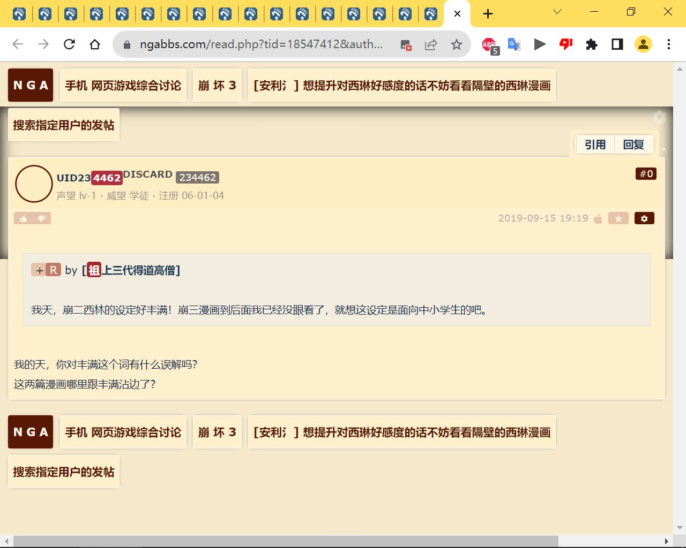
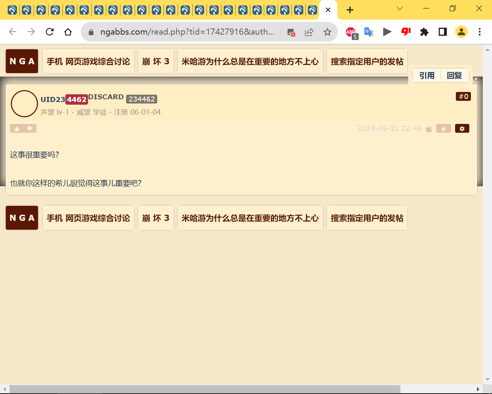
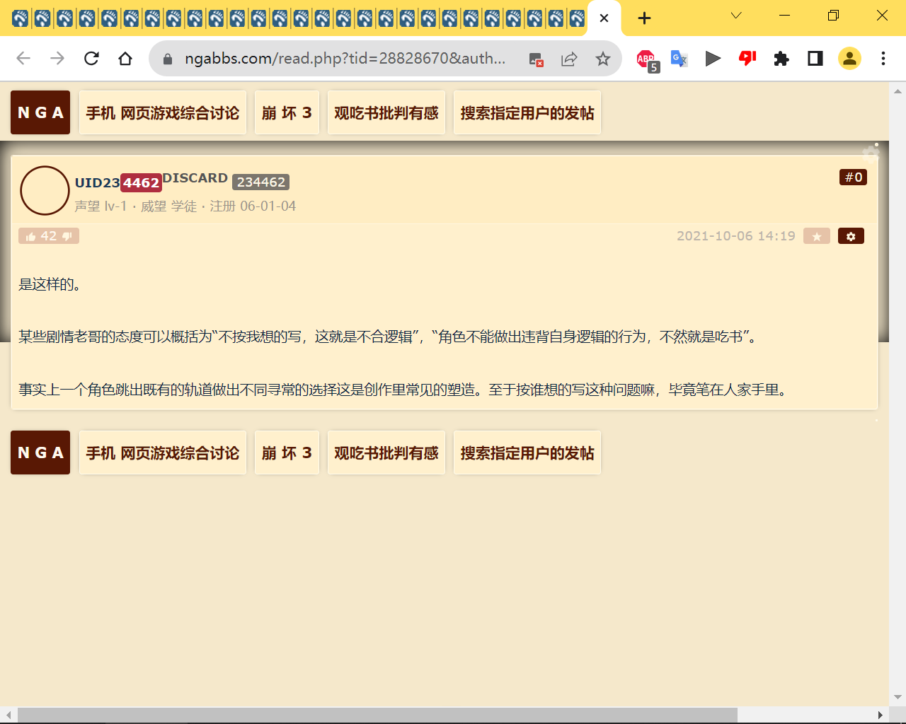
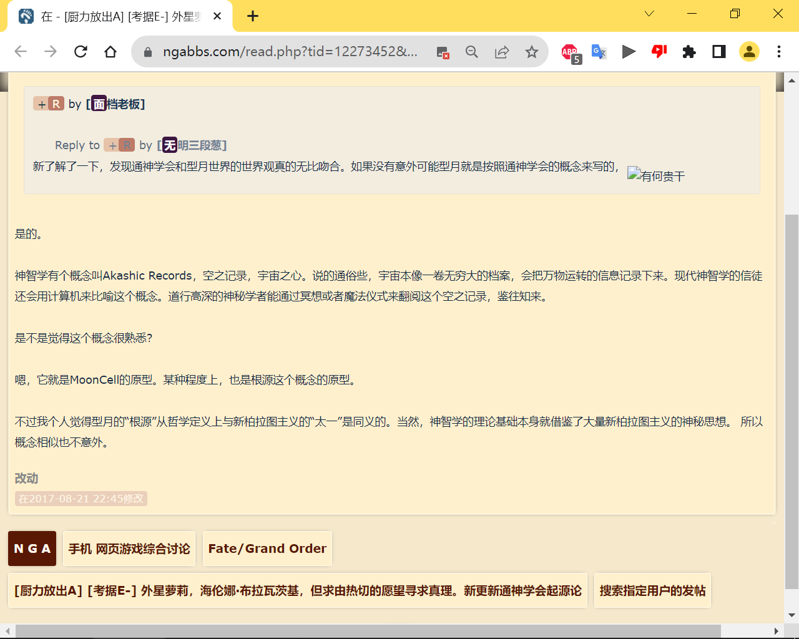
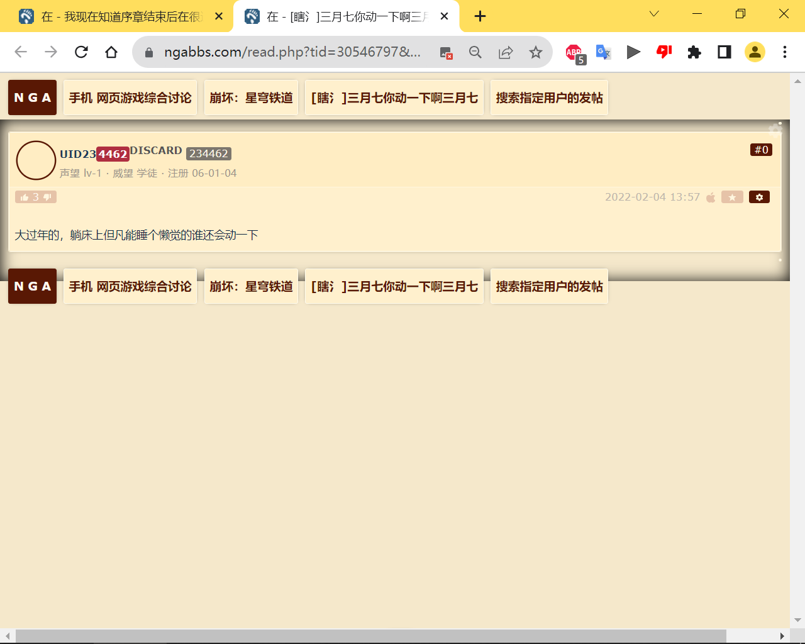
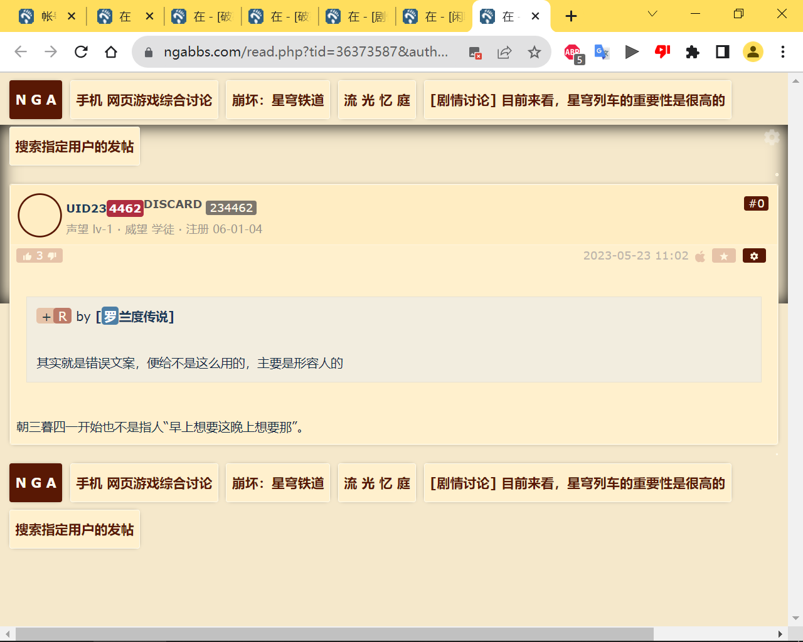

# NGA用户limengan部分评论存档

nga用户(id: 234462) 账号注销前保存的部分评论

内容整理自某nga用户在limengan注销账号前保存的部分数据  


## mengan语录提炼
<details>
  <summary>mengan语录提炼</summary>
  
```身为碟饭顶一个。猪爹会送给你可爱的礼物哟！``` 

```感受这代整体和4的割裂感很重，不过倒是各种小支线氛围塑造的蛮好。``` 

```我震惊了…这真是年一游？有没有主线人直播不早讲了吗…``` 

```一看发帖记录是方舟玩家俺寻思方舟不是有大量少数族裔和差别对待描写的？``` 

```摘一段楼主你之前的关于星铁好不好玩发言好了———本来我觉得还挺不错的，但是看了论坛挺多人说只要让玩家稍微减一下负，给玩家多些资源，星铁作为一个游戏马上就会结束它的游戏寿命，完全没有东西玩我也开始觉得有没有可能星铁作为一个游戏不太行，根本没有多少游戏寿命，也没有什么游戏内容，玩家随便玩一下就可以弃坑了———一个连游戏好不好玩都要靠别人提醒才能反应过来的人。``` 

```是的，应该是一望即穿的人生。``` 

```现在大家明白帝皇为什么要铲除有机生命了吧？打个枪眼然后画靶还觉得自己特别有道德…``` 

```你标题…很se我能看到的只有克拉拉占了帕斯卡大肚…``` 

```战锤里兽人老大也是这样的，体形比别的马仔大一些``` 

```丹枢自己说，不能装义眼之类的东西，那她自己的左手是怎么回事呢？她提到过，那不是侵入式的义体。``` 

```比起游戏人物的寿命，你还是担心一下自己的寿命比较好过了过了，哥。一般大家都是说担心游戏寿命什么的…``` 

```性别是武装直升机(x)布偶(√)``` 

```最早是印度教神话里的妖鬼Rakshasa，在译经中被称为罗刹。俄罗斯Russia的发音与之类，兼俄罗斯人金毛碧眼，所以有了罗刹国的译名。至于仙舟的Luocha我觉得这显然是为了避嫌啊！好歹这都不是同一个世界线。``` 

```哎，等他们公测了要重玩一遍了，你就比他们爽了呀！``` 

```淘宝店里的阿米宝，从几块钱到几百块不等，卡片数量从25个到几百个不等，到底怎么选啊买25张的便宜卡片就行了，总价也就三十块出头之所以有几百张卡片，是因为一张卡一天刷的次数有限。所以淘宝的店家做了一套几百张的卡片让你刷到爆。``` 

```“你要真开个30万的车，那些别人能认出来吗？”楼主发帖记录中最近的一条标题，你们就看看这语病……联系到这帖子里上下文跳脱如猴的'逻辑'，还有各种语死早的不通顺。人又没交学费，咱图个啥非得这么认真治疗他的知识优越感。就，我总觉得玩CRPG，长文本、多对话，玩多了你就算是个猴子怎么都能得到一点语言训练，说话顺溜一点吧？哎，没有。三句话说不出个有意义的观点，五句话里必有一个语病。还“你再琢磨琢磨”…装引导独立思考的学术导师形象。笑死了。``` 

```雪崩还难看啊？这文字爽利程度…不比神经漫游者接受度高一百帕？``` 

```你真的看得懂我说的话吗？而且你上帝这一套也比喻错了，再说DND编辑们也没有给出上帝的位置。你这是自说自话的逻辑，那是你的逻辑不是我的逻辑。我能看懂你说的话，你真的看得懂我说的话吗？DnD里有等位于上帝的造物存在。最后，逻辑教材的逻辑和你脑子里转的那套玩意儿(也就是你称之为“我的逻辑”的那套浆糊)可不是同一回事。设定书设定书不看又要别人服从“我的逻辑”你直接说自己是来秀优越感不好吗？``` 

```我花了钱请了朋友去看，发觉剧本严重拖累了这片。过家家级别的阴谋(连一分钱逻辑合理性都没有)，尬到飞起的愚蠢台词(“我就是天幕，天幕就是我”)，然后是敌人的设置混乱(机器人？植物？还是植物旁的虫子？剧本作者设置了太多可用的敌人，却没有任何的主次筛选)。现在能理解为什么影评人和水军只谈特效了``` 

```希佩我怎么看游戏里是Xipe``` 

```不，是时代变了。互联网时代语言变化速度非常的快。许多旧语汇都被抛弃了。``` 

```./mon_202205/28/mqQ8nj5-ezy4KfToS5t-81.jpg``` 

```城南解是啥？``` 

```提醒各位，请务必使用费恩作为主角``` 

```基本没关系。除了老杨之外，有哪个是跟崩三连上的吗？``` 

```申请战锤40K：混沌之门评测是锤系游戏爱好者./mon_202205/07/biQna03-cpjvKqToS7w-6v.jpg``` 

```acg作品一旦沦入假想概念与现实理论的对比考量，就会完全崩塌……举个例子就是艾尔登法环里的星空是可以被拉塔恩停住的。在现代人的世界观看来星空根本不是天空中的纹路，星星也不是单纯的光点，星空是宇宙的总集，连大地也只是其中的一部分。所以无论神明如何强大有力也不可能停住星辰的运转。但法环的世界观是非常原始神话的——星星就是光点，星星的轨迹就是地上人类的命运，这都是现代天文学出现前人们对世界的看法。ACG的世界观被现实科学观代入后就是这么崩塌的。``` 

```冻土世界，绿化太少……这个问题确实问的非常沁人心脾。``` 

```猫猫，新角色是猫猫``` 

```三张牌：请客、杀头、收下当狗。先打哪张？收下当狗吧。``` 

```请问艾尔登法环的形象在现实中有对应的名字吗，又或者说是按照凯尔特结理念新设计出来的图形？一模一样肯定是没有的。类似东西应该是有的。比如卡巴拉的生命树。``` 

```我说个反对伊蕾娜和海妲是一个人的观点。我(记得)自己是先去了啜泣半岛在路口遇见了伊蕾娜，拿了信。随后出于开地图乱逛的目的跨过风暴山丘的断桥，沿悬崖来到了利耶尼亚的第一个篝火(一个boss也没打)。那时海妲已经站在篝火旁了。不排除记错。``` 

```从没这么烦过老贼的碎片叙事。魂血狼的线性关卡保证你在一段时间内可以专注去做某任务，不必担心丢失。但在开放世界里，人的注意力被无限多的点分散吸引，你在一条任务的开端得知的信息，可能会在很久以后被提起，然后开启下一步，但那时我还记得Step1的信息吗？这就是为啥荒野之息给了你一个任务列表的原因。一味延续传统而不理会游戏的体裁，结果就是许多玩家压根不知道自己跳过了什么步骤。魂like游戏的重玩成本有多高啊？为什么玩家就一定要忍受这种错失任务步骤，不能体验完整内容的不适感呢？``` 

```这周五都去玩老头环了啊``` 

```大过年的，躺床上但凡能睡个懒觉的谁还会动一下``` 

```这个镜头实拍就非常搞笑因为人根本做不出最后这种突然加速动作。只能慢动作拍摄然后效果感人而且离这么近了才拔刀。还不如胸口掏把匕首来得快。侮辱智商了建议看看北野武的《座头市》再说话``` 

```笑死，拽文遇上了行家。可惜没能像古代文人那样临时机变，甩她一句“司马相如没做到的洒家会做到”``` 

```就很简单啊，两人生活需要分享各种细节啊找个时间和他好好聊一聊，说出不和他分享的原因，答应下一次一起分享。``` 

```?实至名归！原神万岁！``` 

```为什么非得是钟表呢，有没有可能这两个都只是定时炸弹呢``` 

```以武犯禁，国难当头，孤身瓦解苇名城防。忠人之事，狼少有的感情表述，我是听爹的还是听主人的，我是直接照着主人的做还是想个更好的法子全救了。护弱锄强，看到人体试验无动于衷，把无辜的人送来做人体试验才能了结支线杀掉已经犯病的罪魁祸首道顺。要硬说的话，一心大爷有那么点侠气，狼只是个没有什么感情的工具人连游戏硬性设计和剧情表达都无法区分。多聊无益。``` 

```武有了，侠在哪里？不要扮演理中客谢谢侠就是以武犯禁，就是忠人之事，就是护弱锄强。孤剑开道，不惧与苇名一国上下为敌，是以武犯禁。信守誓言，为断绝不死舍命奔走，是忠人之事。断臂护主，为保护孩子力斩弦一郎乃至剑圣，是护弱锄强。你既不懂什么是侠，就更别提理解“理客中”了。``` 

```是只狼。很残酷，但事实就是这样。``` 

```我来手动艾特一下@DedsecJohn大文豪，崩版最扭曲的德丽莎黑。``` 

```哥，吹死表活。请你用力批评星铁。顺带说一句这套主角配置属于泛用acg套路了啊。高冷男，活泼女，调节男。``` 

```仙舟联盟原本追求长生后来发现长生有问题。。便开始阻止别的文明长生。。。而钟离那个时候脱离了仙舟坐着陨石来到了提瓦特带来了仙术和长生之力。。。线索是：丹恒来自仙舟联盟丹恒会洞天幻化(具体表现为创造小世界)可能是仙舟联盟的标配技能。。而离月的洞天之术应该也是从钟离开始的。。不要把不同世界观混为一谈啊。原神里都讲过魔神是提瓦特的原生产物。``` 

```过场文字是这么写的命途：星神所行之道。与之同行者,必能领受其恩赐。行迹：角色于“命途”之上所留的足迹,行止越远,奇迹愈显。主角团行走在开拓之道上，不应该是开拓命途的吗？可能，游戏内角色的命途与剧情里是不一样的，剧情里主角团就是开拓命途的。有没有这种可能，人类拥有自由意志…可以随意行走于多个命途上？其中最明显的是瓦杨，这人走在虚无的命途上…可他真的是虚无主义者吗？``` 

```从艾希开始就是个做不出好玩游戏的组。艾希真的是我玩过的横卷轴游戏里极为无聊平庸的作品。如果它不是国产作品，连最后那点讨论度都不会有。只会在游戏里埋梗，是卖梗的电商吗？``` 

```佩拉周围的飞机杯不是这样的形状……至少不是圆柱状的啊……``` 

```兄啊，飞在宇宙中的列车，那毫无疑问是松本零士的银河铁道999啊所有一切公路系故事什么奇诺之旅什么无限流都得往后稍稍啊``` 

```不要玩一。一代剧本结构很差很差。主线推进生硬、节奏凌乱，支线无聊俗套。``` 

```fgo的剧情除去蘑菇和老虚的手笔上乘之外，其他都是及格线上下挣扎的玩意儿。各位吹fgo的老师们就稍稍吧。``` 

```可以期待仙舟？``` 

```牛逼啊朋友们，等铁道学家研究了``` 

```讲个彩蛋，桑博的cv老师的名字拼音是shengbo，可说是命中注定配这个的cv了。``` 

```会出现茶博士刘苏(``` 

```xx大区优秀的匹配机制了``` 

```因为我觉得宇宙主题根本不宏大，只有在上帝视角看才会觉得宏大，而人类真正步入星际时代的生活可能比现在还憋屈，毕竟光速和太阳系的资源总量摆在那里，飞船飞到最近的恒星都要几十几百年，很可能会有几代从出生到死亡都待在星舰里头(要是寿命延长的技术还好说)哥，你这个就已经是科幻思维了。事实上当你看到一辆列车在飞行时你就该怀疑这游戏是不是硬科幻主题(``` 

```帕姆好可爱啊，好想和帕姆发生关系啊。``` 

```是这样的。某些剧情老哥的态度可以概括为“不按我想的写，这就是不合逻辑”，“角色不能做出违背自身逻辑的行为，不然就是吃书”。事实上一个角色跳出既有的轨道做出不同寻常的选择这是创作里常见的塑造。至于按谁想的写这种问题嘛，毕竟笔在人家手里。``` 

```Bianka这个名字已经是最大程度的暗示了啊。``` 

```纠正一下天目流的来源神话。天目一箇神的独眼，并不是关注铁色变化而瞎了一只眼。是因为铁匠在铸剑过程中，需要时时执剑闭上一只眼睛，去仔细校准捶打的剑身是否笔直，因此才有天目一箇的说法。``` 

```好``` 

```我再来补一个吧。千门虚舟(机关阵列)的迷宫附近有一个岩藏流武士，战死前的台词“犹如风吹过哨子的声音……”来自著名日本剑戟片系列《带子雄狼》(也是同名漫画系列)中某个杀手的战死台词。原句好像是“鲜血从脖子里喷出的声音，犹如风吹过哨子一般”。这句台词太过经典，以至于到了王家卫的《东邪西毒》里做了同样的化用。``` 

```楼里有些发言真不愧是泥潭老哥风格``` 

```看来你并没有理解对于创作一个故事而言，要做到“大人看深，孩子看梗”的地步是有多难。``` 

```我讲出我的观点，需要认同吗？还是说只有看到别人认同你，你才愿意讲出自己的观点？这栋楼里的表达的，不都是你所谓的“个人观点”吗？``` 

```有意思啊。消费行为是受消费冲动控制的，同样都是消费冲动，所以抽卡和买单机没有高下分别。但评论是审美行为，审美有高下之分。``` 

```嗐，这楼，简直就是邓宁克鲁格效应的范例展示``` 

```等等，序章结束前在哪有性偶啊…``` 

```80的人用50的天空枪，大招目前爆击砸一下五万，不暴击三万五。我还挺满意的，因为联机每几秒钟满一次q。我觉得辅助或副c的领域里钟离拥有近乎温迪的实力。``` 

```80级，四风+岩伤两件+逆流星两件(没好的角斗士)，屏风加buff，暴击能打出11000-3000左右的伤害，但是不常见。``` 

```嗐，兄弟，泥潭是这样的，邓宁克鲁格效应的最好范例哈哈哈。``` 

```原帖的观点是开放世界制作难度的问题吧。act游戏的地图设计和开放世界的地图设计是不同。``` 

```激动死了，说个悲惨的故事，笔在别人手里。``` 

```说明设置第一道安全手续时没考虑账号本身的安全确认功能…``` 

```艹确实是，赶快给楼主道歉???``` 

```七七：烧伤不息(生生不息)芭芭拉：检彻(检测)！开始！(其实是演奏！开始！)``` 

```然而你遊要抽7隻才完整其他遊戲抽一就行fgo？方舟？``` 

```类似觉得传武高人强过世界格斗选手的迷思。就，不应该问米忽悠在干什么，而要问问自己为什么会有这种错觉。``` 

```ta上过直播^_^``` 

```其实不用特别在意这些联系时间和空间的距离都足够远不出意外的话属于互相埋彩蛋(甚至互相吃书)就像银翼杀手和异形是同世界观机器人笔记实际上是石头门同一世界观有联系但是不会特别影响银翼杀手和异形不是同世界观，只是共用了仿生人这个常见科幻元素而已。老版银翼杀手的时间是2019年，这个时间点人类已经进入庞大的跨星系殖民，仿生人也是从殖民地回来的。异形中维兰公司直到2025年才把第一个仿生人大卫造出来。星际航行需要的冷冻睡眠是在2030年才造出来的。``` 

```谢谢楼主！基本自然科普书质量很高！``` 

```无聊到爆的月经话题``` 

```破晓行动里那些滚动字幕问题很大。滚动的速度，字幕宽度，和游戏快节奏的战斗未必匹配。``` 

```因为没其他装甲可放了(鬼铠``` 

```噗哈哈哈哈哈哈。``` 

```看的我笑出声来，编辑一下``` 

```作为游戏内容的提味部分，文字剧本不像美术资源以直观的视觉元素呈现，而是需要用户在阅读的同时理解和吸收。这样就对剧本的文本长度、风格和技巧都有要求。在如今这个长文本失去市场的时代，大部分的年轻用户没有耐心花上更多的时间成本去进入作者想要营造的文字幻境(同样的内容用美术呈现不是更快么？)而崩三在美术资源的呈现上始终是很优秀的。此外，崩三是一款动作游戏，它的主体是快节奏的ACT玩法，因此对每一个关卡前中后所安置的文本量更有要求。抛弃载体，一味追求舞台剧式的细腻繁复描写并不是做不到，而是会招致基本盘用户的厌弃，会被认为是无病呻吟——这也是我身边许多崩三玩家对FGO的观感：过于日轻的文风，情绪描写繁多，重复的碎片信息过量。看到你举视觉小说为例，我明白你并不理解文本呈现载体对文本本身的呈现限制。特此说明，仅为一家之言。``` 

```人类多样性的观察样本``` 

```“三年又三年，说好了三年后把我调回……”``` 

```“这个吼姆翻翻乐有何意义？浪费玩家脑细胞去记？浪费时间去截图？直接兑换奖励不好吗？”大兄弟，很期待你对老板说“这重复工作有什么意义？浪费我脑细胞？直接发我工资不行吗？”期待！``` 

```“一千五百年前，这里是尊主重返尘世的起点，曾被追随者们视为圣地。”这句话讲的是一千五百年前这里被信徒们认为是圣地。``` 

```楼主知道知乎那位把暴雪面试题晒成回答的朋友吗。后来暴雪直接取消了他的录用资格。虽然面试没啥严格的保密义务，也没有什么条款约束你，但随便跑到论坛上曝光试题其实挺不好的。``` 

```1阿姐的增幅会是谁啊？有没有可能是战场疾风？作为崩崩崩第一个阿姐角色，手感shi的要命，难用的要死...战场疾风的正确食用姿势到底是什么...211章间章里明明是白练变的苍穹游侠，结果实际上却是游侠增幅-苍穹游侠？？我还以为白练终于增幅了呢，结果白练还是白练(动词)3路人女二号：好久没有出场了呢要么不出场，要么出场就被符华暴打，被空律暴打，被丽塔暴打连核心都给拔了，那雷律为什么还在她身体里？身世背景还有一大堆坑没填，没增幅的角色手感差的要第三条，因为芽衣曾经是律者。她的身体被核心同化过，有了“肌肉记忆”，能使用一部分力量。``` 

```我天，崩二西林的设定好丰满！崩三漫画到后面我已经没眼看了，就想这设定是面向中小学生的吧。我的天，你对丰满这个词有什么误解吗？这两篇漫画哪里跟丰满沾边了？``` 

```我记得在11章里，瓦尔特不做人了那节开头牙医kiana板鸭一起遭遇了河豚，然后瓦尔特把河豚宰了拿了核心开了一次大崩坏我刚刚想了想k423不就是河豚的一个人格吗，那个世界怎么出现的两个河豚那个剧情里板鸭自己都说了，时间错位，不是正常的世界泡。``` 

```所以怪灰蛇？你和别人合作，你捅出来的篓子别人擦屁股。然后由于你自己，你的女儿跳进危险。然后你要求合作方把你女儿还回来？好一个爱女心切所以你女儿被生意伙伴坑进海里当了祭品，你支持你的生意伙伴咯？还有，可可利亚什么时候要求灰蛇把板鸭还回来了？她也就是做了大部分当妈的会做的事情——狂怒然后撕破脸而已。``` 

```算了，爱怎么想怎么想吧``` 

```爱咋想咋想吧。``` 

```爱咋想咋想吧，编辑了。``` 

```本来海渊城就是集体降智啊可可利亚什么底牌没有，听到女儿掉海里直接和对面干部翻连，没有任何后手和埋伏。多年的西伯利亚军阀生涯怕是喂了狗灰蛇吃个屁的瘪，这俩身体就是拿来实验的。炸了就炸了也不心疼，他的任务就是让海里的凯文能出来。任务完成了不走留下来喝茶？MEI和凯文好歹都有高光时刻，德莉莎初战到现在除了捶死个冰猪和带队捶死过贝贝龙以外全在吃瘪我觉得有的朋友真的同理心比较差。换个位置思考，你做交易的伙伴把你女儿代替了一个原本该掉坑里的祭品(爱因斯坦)，你什么心情？请你们不要忘了，人物除了应该按照理智行动，也会根据情感来选择，情感本身就是一种逻辑。``` 

```第九章间章2，板鸭回忆中明确提到普通学生还在学院里，板鸭还在为此担心。你云了还是我云了再补个破晓行动全对话吧，可能是我看的不认真，从头到尾就只有个以太小队啊https://ngabbs.com/read.php?tid=17016157看了一遍，给你道个歉，raid文本里确实只出现了以太小队。我记得之前任务文案里看到过类似的介绍，可能走岔眼了。另外纠正一点，9章间章2里板鸭提到的“学院被毁，学生被镇压”的噩梦来自她和灰蛇精神交流产生的幻觉。我去看了一遍那段对话。灰蛇有句台词：这种恐惧比现实更让你害怕。就是指他利用了布洛尼亚的心理制造这段幻影。所以学院本身从未遭到过奥托的攻击。(至少没有正面描写过。)``` 

```学院是有普通学生的啊，虽然直接被甩着自生自灭去了，我对崩坏3的剧情反感就是这里，在崩坏3中这些背景板角色的命好像就不是命一样。雪狼小队死完了陨石下三千万人?但西林好可怜我好想补偿她。k423被抓了?她是我最重要的宝物普通学生直接丢着不管了扯几把蛋呢，你去玩玩raid破晓行动，开头介绍里讲明了愿意跟随德丽莎的女武神都上船了。``` 

```要不你自己回顾一下第九章间章德丽莎的种种发言及表现？这总不算“旧账”了。那里边她差不多就是一副“只要琪亚娜(k423)没事世界我管他去死”的态度哦(她有句原话就这意思)不要以一成不变的眼光看待事物，这点我120%同意，但问题是近几章德丽莎的人物形象有变得更好，或者说，更吸引人吗？实际上，恐怕没有。近几章大姨妈的人物塑造依旧没什么起色，甚至还开了一次倒车(第九章间章)，这可不是我要把她钉死，是编剧不让她翻身呀至于本体娜是谁其实并不重要，重要的是德丽莎我觉得DedsecJohn你对德丽莎的偏见严重到了要把一句话往最恶毒的地方理解的程度。我翻了翻第九章间章的剧情，找到了你说的那句话。剧情里，德丽莎希望让人形机跟自己上船，从她大脑中获取琪亚娜行踪的情报，她认为“找到琪亚娜，就能结束大崩坏”(真的吗？个人猜想吧。)。人形机表示我不仅是个人形机，还是个计算工具，从推算结果上来说，人类战胜崩坏的希望渺茫之极，你就算找到你学生的行踪，你所做的一切最终还是没有意义。所以德丽莎这么回答她：“就算找到琪亚娜无法结束大崩坏，就算如此我也要带她回家，一起迎接这个世界的末日。因为带她回家，就是意义本身。”这句话里两个意思很明显：1...``` 

```现在有三话神之键秘话，分别是地藏，天火和苍玄之书，而在天火的时候说的凯文幸存下来，而在天火之前的月影篇说hua(上仙)是上个纪元的超级战士，当然在天火篇中侧面描画了冷冻舱，所以我们仍未知道上个纪元埋了多少超级战士，吃书预订这不叫吃书，这叫伏笔收回。按照漫画主线加三个神之键秘话交代的概念，融合战士的数量是未知的(只是制造的数量相对总人口而言仍然极为稀少)。月球战终焉之后，存活的最强战士数量是明确的。只要不违背以上两点，根本谈不上吃书。``` 

```这个吃书越来越严重了，原先说的是只塞了上仙一个超级战士，然后为了圆剧情又把凯文也塞了进去，最后怕不是整个世界蛇都是超级战士，你们到底塞了多少超级战士啊哪里吃书了啊！自己去看漫画啊！``` 

```希望兄弟你能走出来，祝你以后过得开心。``` 

```DeusexMachina=GodinMachine在科幻作品里看到这个词，一般直接理解“机械中宿有神明”的意思。别想多了什么讽刺策划。``` 

```去客串鬼泣5了``` 

```真是个暴躁老哥。版本更新内容缓慢释出，一下子放出消耗完了，可不就失去兴趣了吗。我寻思你是游戏玩太少了吧。``` 

```没关系，月下的活动故事本身也不是主线。那张照片里摸姬子脑袋的男人也没露脸。``` 

```你知道吗，幽兰黛尔的原型是C罗。``` 

```这事很重要吗？也就你这样的希儿厨觉得这事儿重要吧？``` 

```在印度教神话的某个说法里，修罗是酒神。在天神与阿修罗搅乳海求长生药的过程中，修罗就是搅乳海的副产物(其他的还有帝释天的白象、毗湿奴的配偶吉祥天女等等)。天神们接受了修罗，而阿修罗一族拒绝了修罗。因此阿修罗得名。这个“阿”在梵语里是否定冠词，表达“非修罗”的意思。参见本书https://book.douban.com/subject/3145386/这书是根据苏联的梵文学者的著述翻译整理的。``` 

```去CG界面，下载全部资源。如果是删除原客户端，去重新下载来升级版本的话，会缺失语音的。``` 

```ReplytoReplyPostby无明三段葱(2017-08-2107:52)新了解了一下，发现通神学会和型月世界的世界观真的无比吻合。如果没有意外可能型月就是按照通神学会的概念来写的，是的。神智学有个概念叫AkashicRecords，空之记录，宇宙之心。说的通俗些，宇宙本像一卷无穷大的档案，会把万物运转的信息记录下来。现代神智学的信徒还会用计算机来比喻这个概念。道行高深的神秘学者能通过冥想或者魔法仪式来翻阅这个空之记录，鉴往知来。是不是觉得这个概念很熟悉?嗯，它就是MoonCell的原型。某种程度上，也是根源这个概念的原型。不过我个人觉得型月的“根源”从哲学定义上与新柏拉图主义的“太一”是同义的。当然，神智学的理论基础本身就借鉴了大量新柏拉图主义的神秘思想。所以概念相似也不意外。``` 

```虽然不知道钥石具体设定是怎样的。但它应该跟所有传送魔法一样遵循相同的规则吧？没去过一次的地方是没法用传送术抵达的。而且钥匙在DH的出生任务里似乎说的是连通所有““军团星球””的东西。不知道为啥这里能连到艾泽拉斯……谜之设定。``` 

```根源就是哲学里新柏拉图主义的“太一”。你可以百度一下相关词条。感受一下这二者的相似性。``` 

```楼主你对空的解释我认为有偏颇。空并不是装水的杯子，而是杯子和水一块的整体(假设此外再无他物了)。蘑菇这里把“空”的概念和新柏拉图主义所谓的“太一”(也就是型月设定里的“根源”)设为一体了。在新柏拉图主义里，万物从太一流出，所谓流出代表着万物并不独立于太一，而是太一自身的变化(如果这个变化过程是非时间性的)。空(佛教)——道(道家)——太一(新柏拉图主义)这三种东西，从哲学内涵上讲其实是一种东西。不可以语言(理性)描述，只能以心灵契合来加以感受。换句话说，这三个所谓的终极真理，都是人类理性之外的事物，人类有限的理性(语言)不可能加以诠释。实际上《空之境界》仅仅从故事内容的角度来讲，只是借用了佛教的术语和型月的世界设定进行一个桥接(提升逼格)，本身并没有什么强关联性。整个空境系列，主要表达的还是日本人独有的物哀与幽玄的美学，以及那种泡沫经济破灭后的衰颓气氛，顺带加上少女和少男之间的人情故事。``` 

```剑禅一如是日本的剑道思想哎。``` 
 
</details>


## mengan部分评论截图整理
<details open>
  <summary>截图整理</summary>

[https://ngabbs.com/read.php?tid=10901931&authorid=234462](https://ngabbs.com/read.php?tid=10901931&authorid=234462)  
内容不可见  

[https://ngabbs.com/read.php?tid=11179489&authorid=234462](https://ngabbs.com/read.php?tid=11179489&authorid=234462)
  

[https://ngabbs.com/read.php?tid=9979562&authorid=234462](https://ngabbs.com/read.php?tid=9979562&authorid=234462)  
内容不可见  

[https://ngabbs.com/read.php?tid=29182306&authorid=234462](https://ngabbs.com/read.php?tid=29182306&authorid=234462)
  

[https://ngabbs.com/read.php?tid=29281621&authorid=234462](https://ngabbs.com/read.php?tid=29281621&authorid=234462)
  

[https://ngabbs.com/read.php?tid=24249317&authorid=234462](https://ngabbs.com/read.php?tid=24249317&authorid=234462)  
内容不可见  

[https://ngabbs.com/read.php?tid=26036766&authorid=234462](https://ngabbs.com/read.php?tid=26036766&authorid=234462)
  

[https://ngabbs.com/read.php?tid=17828403&authorid=234462](https://ngabbs.com/read.php?tid=17828403&authorid=234462)
  

[https://ngabbs.com/read.php?tid=16289116&authorid=234462](https://ngabbs.com/read.php?tid=16289116&authorid=234462)  
内容不可见  

[https://ngabbs.com/read.php?tid=24234056&authorid=234462](https://ngabbs.com/read.php?tid=24234056&authorid=234462)  
内容不可见  

[https://ngabbs.com/read.php?tid=14291253&authorid=234462](https://ngabbs.com/read.php?tid=14291253&authorid=234462)  
内容不可见  

[https://ngabbs.com/read.php?tid=31675637&authorid=234462](https://ngabbs.com/read.php?tid=31675637&authorid=234462)
  

[https://ngabbs.com/read.php?tid=11385805&authorid=234462](https://ngabbs.com/read.php?tid=11385805&authorid=234462)  
内容不可见  

[https://ngabbs.com/read.php?tid=1399883&authorid=234462](https://ngabbs.com/read.php?tid=1399883&authorid=234462)  
内容不可见  

[https://ngabbs.com/read.php?tid=35197389&authorid=234462](https://ngabbs.com/read.php?tid=35197389&authorid=234462)  
内容不可见  

[https://ngabbs.com/read.php?tid=24046018&authorid=234462](https://ngabbs.com/read.php?tid=24046018&authorid=234462)
  

[https://ngabbs.com/read.php?tid=36403005&authorid=234462](https://ngabbs.com/read.php?tid=36403005&authorid=234462)
  

[https://ngabbs.com/read.php?tid=17938748&authorid=234462](https://ngabbs.com/read.php?tid=17938748&authorid=234462)
  

[https://ngabbs.com/read.php?tid=12203753&authorid=234462](https://ngabbs.com/read.php?tid=12203753&authorid=234462)  
内容不可见  

[https://ngabbs.com/read.php?tid=11550037&authorid=234462](https://ngabbs.com/read.php?tid=11550037&authorid=234462)  
内容不可见  

[https://ngabbs.com/read.php?tid=22443617&authorid=234462](https://ngabbs.com/read.php?tid=22443617&authorid=234462)
  

[https://ngabbs.com/read.php?tid=29634412&authorid=234462](https://ngabbs.com/read.php?tid=29634412&authorid=234462)
  

[https://ngabbs.com/read.php?tid=29225379&authorid=234462](https://ngabbs.com/read.php?tid=29225379&authorid=234462)
  

[https://ngabbs.com/read.php?tid=24202489&authorid=234462](https://ngabbs.com/read.php?tid=24202489&authorid=234462)
  

[https://ngabbs.com/read.php?tid=36571542&authorid=234462](https://ngabbs.com/read.php?tid=36571542&authorid=234462)
  

[https://ngabbs.com/read.php?tid=11885798&authorid=234462](https://ngabbs.com/read.php?tid=11885798&authorid=234462)  
内容不可见  

[https://ngabbs.com/read.php?tid=18547412&authorid=234462](https://ngabbs.com/read.php?tid=18547412&authorid=234462)
  

[https://ngabbs.com/read.php?tid=32089755&authorid=234462](https://ngabbs.com/read.php?tid=32089755&authorid=234462)
  

[https://ngabbs.com/read.php?tid=28913241&authorid=234462](https://ngabbs.com/read.php?tid=28913241&authorid=234462)  
内容不可见  

[https://ngabbs.com/read.php?tid=18456898&authorid=234462](https://ngabbs.com/read.php?tid=18456898&authorid=234462)
  

[https://ngabbs.com/read.php?tid=31841986&authorid=234462](https://ngabbs.com/read.php?tid=31841986&authorid=234462)
  

[https://ngabbs.com/read.php?tid=16896358&authorid=234462](https://ngabbs.com/read.php?tid=16896358&authorid=234462)
  

[https://ngabbs.com/read.php?tid=30021332&authorid=234462](https://ngabbs.com/read.php?tid=30021332&authorid=234462)
  

[https://ngabbs.com/read.php?tid=24110150&authorid=234462](https://ngabbs.com/read.php?tid=24110150&authorid=234462)
  

[https://ngabbs.com/read.php?tid=29884481&authorid=234462](https://ngabbs.com/read.php?tid=29884481&authorid=234462)  
内容不可见  

[https://ngabbs.com/read.php?tid=33525927&authorid=234462](https://ngabbs.com/read.php?tid=33525927&authorid=234462)
  

[https://ngabbs.com/read.php?tid=12677472&authorid=234462](https://ngabbs.com/read.php?tid=12677472&authorid=234462)  
内容不可见  

[https://ngabbs.com/read.php?tid=36208577&authorid=234462](https://ngabbs.com/read.php?tid=36208577&authorid=234462)
  

[https://ngabbs.com/read.php?tid=28568861&authorid=234462](https://ngabbs.com/read.php?tid=28568861&authorid=234462)
  

[https://ngabbs.com/read.php?tid=28816940&authorid=234462](https://ngabbs.com/read.php?tid=28816940&authorid=234462)
  

[https://ngabbs.com/read.php?tid=10946266&authorid=234462](https://ngabbs.com/read.php?tid=10946266&authorid=234462)  
内容不可见  

[https://ngabbs.com/read.php?tid=31676409&authorid=234462](https://ngabbs.com/read.php?tid=31676409&authorid=234462)
  

[https://ngabbs.com/read.php?tid=19881342&authorid=234462](https://ngabbs.com/read.php?tid=19881342&authorid=234462)
  

[https://ngabbs.com/read.php?tid=18625934&authorid=234462](https://ngabbs.com/read.php?tid=18625934&authorid=234462)
  

[https://ngabbs.com/read.php?tid=33091220&authorid=234462](https://ngabbs.com/read.php?tid=33091220&authorid=234462)
  

[https://ngabbs.com/read.php?tid=29789102&authorid=234462](https://ngabbs.com/read.php?tid=29789102&authorid=234462)
  

[https://ngabbs.com/read.php?tid=31740211&authorid=234462](https://ngabbs.com/read.php?tid=31740211&authorid=234462)
  

[https://ngabbs.com/read.php?tid=21771249&authorid=234462](https://ngabbs.com/read.php?tid=21771249&authorid=234462)
  

[https://ngabbs.com/read.php?tid=18029373&authorid=234462](https://ngabbs.com/read.php?tid=18029373&authorid=234462)
  

[https://ngabbs.com/read.php?tid=32118656&authorid=234462](https://ngabbs.com/read.php?tid=32118656&authorid=234462)
  

[https://ngabbs.com/read.php?tid=31781681&authorid=234462](https://ngabbs.com/read.php?tid=31781681&authorid=234462)
  

[https://ngabbs.com/read.php?tid=29197674&authorid=234462](https://ngabbs.com/read.php?tid=29197674&authorid=234462)
  

[https://ngabbs.com/read.php?tid=16652723&authorid=234462](https://ngabbs.com/read.php?tid=16652723&authorid=234462)  
内容不可见  

[https://ngabbs.com/read.php?tid=30788416&authorid=234462](https://ngabbs.com/read.php?tid=30788416&authorid=234462)
  

[https://ngabbs.com/read.php?tid=1431406&authorid=234462](https://ngabbs.com/read.php?tid=1431406&authorid=234462)  
内容不可见  

[https://ngabbs.com/read.php?tid=29196580&authorid=234462](https://ngabbs.com/read.php?tid=29196580&authorid=234462)
  

[https://ngabbs.com/read.php?tid=11443539&authorid=234462](https://ngabbs.com/read.php?tid=11443539&authorid=234462)  
内容不可见  

[https://ngabbs.com/read.php?tid=29739358&authorid=234462](https://ngabbs.com/read.php?tid=29739358&authorid=234462)
  

[https://ngabbs.com/read.php?tid=18354883&authorid=234462](https://ngabbs.com/read.php?tid=18354883&authorid=234462)
  

[https://ngabbs.com/read.php?tid=12755371&authorid=234462](https://ngabbs.com/read.php?tid=12755371&authorid=234462)  
内容不可见  

[https://ngabbs.com/read.php?tid=9358351&authorid=234462](https://ngabbs.com/read.php?tid=9358351&authorid=234462)  
内容不可见  

[https://ngabbs.com/read.php?tid=16830265&authorid=234462](https://ngabbs.com/read.php?tid=16830265&authorid=234462)
  

[https://ngabbs.com/read.php?tid=11724758&authorid=234462](https://ngabbs.com/read.php?tid=11724758&authorid=234462)  
内容不可见  

[https://ngabbs.com/read.php?tid=36554176&authorid=234462](https://ngabbs.com/read.php?tid=36554176&authorid=234462)
  

[https://ngabbs.com/read.php?tid=19062956&authorid=234462](https://ngabbs.com/read.php?tid=19062956&authorid=234462)
  

[https://ngabbs.com/read.php?tid=24347062&authorid=234462](https://ngabbs.com/read.php?tid=24347062&authorid=234462)  
内容不可见  

[https://ngabbs.com/read.php?tid=28855813&authorid=234462](https://ngabbs.com/read.php?tid=28855813&authorid=234462)
  

[https://ngabbs.com/read.php?tid=19817348&authorid=234462](https://ngabbs.com/read.php?tid=19817348&authorid=234462)
  

[https://ngabbs.com/read.php?tid=36171237&authorid=234462](https://ngabbs.com/read.php?tid=36171237&authorid=234462)
  

[https://ngabbs.com/read.php?tid=36457355&authorid=234462](https://ngabbs.com/read.php?tid=36457355&authorid=234462)
  

[https://ngabbs.com/read.php?tid=11776274&authorid=234462](https://ngabbs.com/read.php?tid=11776274&authorid=234462)
  

[https://ngabbs.com/read.php?tid=11399444&authorid=234462](https://ngabbs.com/read.php?tid=11399444&authorid=234462)  
内容不可见  

[https://ngabbs.com/read.php?tid=11951743&authorid=234462](https://ngabbs.com/read.php?tid=11951743&authorid=234462)  
内容不可见  

[https://ngabbs.com/read.php?tid=817666&authorid=234462](https://ngabbs.com/read.php?tid=817666&authorid=234462)  
内容不可见  

[https://ngabbs.com/read.php?tid=32082082&authorid=234462](https://ngabbs.com/read.php?tid=32082082&authorid=234462)
  

[https://ngabbs.com/read.php?tid=20390028&authorid=234462](https://ngabbs.com/read.php?tid=20390028&authorid=234462)
  

[https://ngabbs.com/read.php?tid=1361968&authorid=234462](https://ngabbs.com/read.php?tid=1361968&authorid=234462)  
内容不可见  

[https://ngabbs.com/read.php?tid=17427916&authorid=234462](https://ngabbs.com/read.php?tid=17427916&authorid=234462)
  

[https://ngabbs.com/read.php?tid=15180068&authorid=234462](https://ngabbs.com/read.php?tid=15180068&authorid=234462)  
内容不可见  

[https://ngabbs.com/read.php?tid=17937748&authorid=234462](https://ngabbs.com/read.php?tid=17937748&authorid=234462)
  

[https://ngabbs.com/read.php?tid=11063317&authorid=234462](https://ngabbs.com/read.php?tid=11063317&authorid=234462)  
内容不可见  

[https://ngabbs.com/read.php?tid=11855459&authorid=234462](https://ngabbs.com/read.php?tid=11855459&authorid=234462)  
内容不可见  

[https://ngabbs.com/read.php?tid=12410894&authorid=234462](https://ngabbs.com/read.php?tid=12410894&authorid=234462)  
内容不可见  

[https://ngabbs.com/read.php?tid=17267390&authorid=234462](https://ngabbs.com/read.php?tid=17267390&authorid=234462)  
内容不可见  

[https://ngabbs.com/read.php?tid=9754261&authorid=234462](https://ngabbs.com/read.php?tid=9754261&authorid=234462)  
内容不可见  

[https://ngabbs.com/read.php?tid=1057876&authorid=234462](https://ngabbs.com/read.php?tid=1057876&authorid=234462)  
内容不可见  

[https://ngabbs.com/read.php?tid=1325539&authorid=234462](https://ngabbs.com/read.php?tid=1325539&authorid=234462)  
内容不可见  

[https://ngabbs.com/read.php?tid=28828670&authorid=234462](https://ngabbs.com/read.php?tid=28828670&authorid=234462)
  

[https://ngabbs.com/read.php?tid=35188017&authorid=234462](https://ngabbs.com/read.php?tid=35188017&authorid=234462)  
内容不可见  

[https://ngabbs.com/read.php?tid=29383682&authorid=234462](https://ngabbs.com/read.php?tid=29383682&authorid=234462)
  

[https://ngabbs.com/read.php?tid=30104505&authorid=234462](https://ngabbs.com/read.php?tid=30104505&authorid=234462)
  

[https://ngabbs.com/read.php?tid=17298560&authorid=234462](https://ngabbs.com/read.php?tid=17298560&authorid=234462)
  

[https://ngabbs.com/read.php?tid=11633149&authorid=234462](https://ngabbs.com/read.php?tid=11633149&authorid=234462)  
内容不可见  

[https://ngabbs.com/read.php?tid=36249443&authorid=234462](https://ngabbs.com/read.php?tid=36249443&authorid=234462)
  

[https://ngabbs.com/read.php?tid=9914766&authorid=234462](https://ngabbs.com/read.php?tid=9914766&authorid=234462)  
内容不可见  

[https://ngabbs.com/read.php?tid=28729304&authorid=234462](https://ngabbs.com/read.php?tid=28729304&authorid=234462)
  

[https://ngabbs.com/read.php?tid=34410662&authorid=234462](https://ngabbs.com/read.php?tid=34410662&authorid=234462)
  

[https://ngabbs.com/read.php?tid=24431758&authorid=234462](https://ngabbs.com/read.php?tid=24431758&authorid=234462)
  

[https://ngabbs.com/read.php?tid=13526887&authorid=234462](https://ngabbs.com/read.php?tid=13526887&authorid=234462)  
内容不可见  

[https://ngabbs.com/read.php?tid=28864717&authorid=234462](https://ngabbs.com/read.php?tid=28864717&authorid=234462)
  

[https://ngabbs.com/read.php?tid=11209938&authorid=234462](https://ngabbs.com/read.php?tid=11209938&authorid=234462)  
内容不可见  

[https://ngabbs.com/read.php?tid=18030736&authorid=234462](https://ngabbs.com/read.php?tid=18030736&authorid=234462)
  

[https://ngabbs.com/read.php?tid=19095107&authorid=234462](https://ngabbs.com/read.php?tid=19095107&authorid=234462)
  

[https://ngabbs.com/read.php?tid=17052319&authorid=234462](https://ngabbs.com/read.php?tid=17052319&authorid=234462)
  

[https://ngabbs.com/read.php?tid=17082528&authorid=234462](https://ngabbs.com/read.php?tid=17082528&authorid=234462)  
内容不可见  

[https://ngabbs.com/read.php?tid=13454271&authorid=234462](https://ngabbs.com/read.php?tid=13454271&authorid=234462)  
内容不可见  

[https://ngabbs.com/read.php?tid=11800131&authorid=234462](https://ngabbs.com/read.php?tid=11800131&authorid=234462)  
内容不可见  

[https://ngabbs.com/read.php?tid=29371965&authorid=234462](https://ngabbs.com/read.php?tid=29371965&authorid=234462)
  

[https://ngabbs.com/read.php?tid=28509100&authorid=234462](https://ngabbs.com/read.php?tid=28509100&authorid=234462)
  

[https://ngabbs.com/read.php?tid=9899148&authorid=234462](https://ngabbs.com/read.php?tid=9899148&authorid=234462)  
内容不可见  

[https://ngabbs.com/read.php?tid=14367248&authorid=234462](https://ngabbs.com/read.php?tid=14367248&authorid=234462)  
内容不可见  

[https://ngabbs.com/read.php?tid=10932930&authorid=234462](https://ngabbs.com/read.php?tid=10932930&authorid=234462)  
内容不可见  

[https://ngabbs.com/read.php?tid=33418635&authorid=234462](https://ngabbs.com/read.php?tid=33418635&authorid=234462)
  

[https://ngabbs.com/read.php?tid=29291177&authorid=234462](https://ngabbs.com/read.php?tid=29291177&authorid=234462)
  

[https://ngabbs.com/read.php?tid=9883031&authorid=234462](https://ngabbs.com/read.php?tid=9883031&authorid=234462)  
内容不可见  

[https://ngabbs.com/read.php?tid=28895124&authorid=234462](https://ngabbs.com/read.php?tid=28895124&authorid=234462)
  

[https://ngabbs.com/read.php?tid=11871466&authorid=234462](https://ngabbs.com/read.php?tid=11871466&authorid=234462)
  

[https://ngabbs.com/read.php?tid=36171602&authorid=234462](https://ngabbs.com/read.php?tid=36171602&authorid=234462)
  

[https://ngabbs.com/read.php?tid=27429001&authorid=234462](https://ngabbs.com/read.php?tid=27429001&authorid=234462)
  

[https://ngabbs.com/read.php?tid=24208978&authorid=234462](https://ngabbs.com/read.php?tid=24208978&authorid=234462)
  

[https://ngabbs.com/read.php?tid=11167428&authorid=234462](https://ngabbs.com/read.php?tid=11167428&authorid=234462)  
内容不可见  

[https://ngabbs.com/read.php?tid=10919511&authorid=234462](https://ngabbs.com/read.php?tid=10919511&authorid=234462)  
内容不可见  

[https://ngabbs.com/read.php?tid=12273452&authorid=234462](https://ngabbs.com/read.php?tid=12273452&authorid=234462)
  

[https://ngabbs.com/read.php?tid=18268561&authorid=234462](https://ngabbs.com/read.php?tid=18268561&authorid=234462)
  

[https://ngabbs.com/read.php?tid=12521301&authorid=234462](https://ngabbs.com/read.php?tid=12521301&authorid=234462)  
内容不可见  

[https://ngabbs.com/read.php?tid=3001921&authorid=234462](https://ngabbs.com/read.php?tid=3001921&authorid=234462)
  

[https://ngabbs.com/read.php?tid=29167543&authorid=234462](https://ngabbs.com/read.php?tid=29167543&authorid=234462)
  

[https://ngabbs.com/read.php?tid=29296295&authorid=234462](https://ngabbs.com/read.php?tid=29296295&authorid=234462)
  

[https://ngabbs.com/read.php?tid=21860509&authorid=234462](https://ngabbs.com/read.php?tid=21860509&authorid=234462)
  

[https://ngabbs.com/read.php?tid=9984603&authorid=234462](https://ngabbs.com/read.php?tid=9984603&authorid=234462)  
内容不可见  

[https://ngabbs.com/read.php?tid=10888671&authorid=234462](https://ngabbs.com/read.php?tid=10888671&authorid=234462)  
内容不可见  

[https://ngabbs.com/read.php?tid=11059826&authorid=234462](https://ngabbs.com/read.php?tid=11059826&authorid=234462)  
内容不可见  

[https://ngabbs.com/read.php?tid=23968148&authorid=234462](https://ngabbs.com/read.php?tid=23968148&authorid=234462)
  

[https://ngabbs.com/read.php?tid=14322558&authorid=234462](https://ngabbs.com/read.php?tid=14322558&authorid=234462)  
内容不可见  

[https://ngabbs.com/read.php?tid=36103893&authorid=234462](https://ngabbs.com/read.php?tid=36103893&authorid=234462)
  

[https://ngabbs.com/read.php?tid=21050614&authorid=234462](https://ngabbs.com/read.php?tid=21050614&authorid=234462)
  

[https://ngabbs.com/read.php?tid=36125563&authorid=234462](https://ngabbs.com/read.php?tid=36125563&authorid=234462)
  

[https://ngabbs.com/read.php?tid=11829824&authorid=234462](https://ngabbs.com/read.php?tid=11829824&authorid=234462)  
内容不可见  

[https://ngabbs.com/read.php?tid=9921131&authorid=234462](https://ngabbs.com/read.php?tid=9921131&authorid=234462)  
内容不可见  

[https://ngabbs.com/read.php?tid=1544971&authorid=234462](https://ngabbs.com/read.php?tid=1544971&authorid=234462)  
内容不可见  

[https://ngabbs.com/read.php?tid=11016894&authorid=234462](https://ngabbs.com/read.php?tid=11016894&authorid=234462)  
内容不可见  

[https://ngabbs.com/read.php?tid=1546912&authorid=234462](https://ngabbs.com/read.php?tid=1546912&authorid=234462)  
内容不可见  

[https://ngabbs.com/read.php?tid=36318991&authorid=234462](https://ngabbs.com/read.php?tid=36318991&authorid=234462)
  

[https://ngabbs.com/read.php?tid=18426216&authorid=234462](https://ngabbs.com/read.php?tid=18426216&authorid=234462)

  

[https://ngabbs.com/read.php?tid=11221186&authorid=234462](https://ngabbs.com/read.php?tid=11221186&authorid=234462)  
内容不可见  

[https://ngabbs.com/read.php?tid=19275262&authorid=234462](https://ngabbs.com/read.php?tid=19275262&authorid=234462)
  

[https://ngabbs.com/read.php?tid=10867060&authorid=234462](https://ngabbs.com/read.php?tid=10867060&authorid=234462)  
内容不可见  

[https://ngabbs.com/read.php?tid=11880490&authorid=234462](https://ngabbs.com/read.php?tid=11880490&authorid=234462)  
内容不可见  

[https://ngabbs.com/read.php?tid=29530409&authorid=234462](https://ngabbs.com/read.php?tid=29530409&authorid=234462)  
内容不可见  

[https://ngabbs.com/read.php?tid=24265456&authorid=234462](https://ngabbs.com/read.php?tid=24265456&authorid=234462)  
内容不可见  

[https://ngabbs.com/read.php?tid=19524548&authorid=234462](https://ngabbs.com/read.php?tid=19524548&authorid=234462)
  

[https://ngabbs.com/read.php?tid=36385535&authorid=234462](https://ngabbs.com/read.php?tid=36385535&authorid=234462)
  

[https://ngabbs.com/read.php?tid=11825213&authorid=234462](https://ngabbs.com/read.php?tid=11825213&authorid=234462)  
内容不可见  

[https://ngabbs.com/read.php?tid=31540791&authorid=234462](https://ngabbs.com/read.php?tid=31540791&authorid=234462)  
内容不可见  

[https://ngabbs.com/read.php?tid=28016578&authorid=234462](https://ngabbs.com/read.php?tid=28016578&authorid=234462)
  

[https://ngabbs.com/read.php?tid=32088139&authorid=234462](https://ngabbs.com/read.php?tid=32088139&authorid=234462)
  

[https://ngabbs.com/read.php?tid=27640314&authorid=234462](https://ngabbs.com/read.php?tid=27640314&authorid=234462)
  

[https://ngabbs.com/read.php?tid=11073199&authorid=234462](https://ngabbs.com/read.php?tid=11073199&authorid=234462)  
内容不可见  

[https://ngabbs.com/read.php?tid=10933704&authorid=234462](https://ngabbs.com/read.php?tid=10933704&authorid=234462)  
内容不可见  

[https://ngabbs.com/read.php?tid=9912444&authorid=234462](https://ngabbs.com/read.php?tid=9912444&authorid=234462)  
内容不可见  

[https://ngabbs.com/read.php?tid=31692075&authorid=234462](https://ngabbs.com/read.php?tid=31692075&authorid=234462)
  

[https://ngabbs.com/read.php?tid=36157373&authorid=234462](https://ngabbs.com/read.php?tid=36157373&authorid=234462)
  

[https://ngabbs.com/read.php?tid=25262087&authorid=234462](https://ngabbs.com/read.php?tid=25262087&authorid=234462)
  

[https://ngabbs.com/read.php?tid=30546797&authorid=234462](https://ngabbs.com/read.php?tid=30546797&authorid=234462)
  

[https://ngabbs.com/read.php?tid=12485099&authorid=234462](https://ngabbs.com/read.php?tid=12485099&authorid=234462)  
内容不可见  

[https://ngabbs.com/read.php?tid=31680762&authorid=234462](https://ngabbs.com/read.php?tid=31680762&authorid=234462)
  

[https://ngabbs.com/read.php?tid=31003045&authorid=234462](https://ngabbs.com/read.php?tid=31003045&authorid=234462)
  

[https://ngabbs.com/read.php?tid=30911633&authorid=234462](https://ngabbs.com/read.php?tid=30911633&authorid=234462)
  

[https://ngabbs.com/read.php?tid=29597855&authorid=234462](https://ngabbs.com/read.php?tid=29597855&authorid=234462)
  

[https://ngabbs.com/read.php?tid=18406822&authorid=234462](https://ngabbs.com/read.php?tid=18406822&authorid=234462)
  

[https://ngabbs.com/read.php?tid=36373587&authorid=234462](https://ngabbs.com/read.php?tid=36373587&authorid=234462)
  

[https://ngabbs.com/read.php?tid=35327011&authorid=234462](https://ngabbs.com/read.php?tid=35327011&authorid=234462)
  

[https://ngabbs.com/read.php?tid=24165140&authorid=234462](https://ngabbs.com/read.php?tid=24165140&authorid=234462)  
内容不可见  

[https://ngabbs.com/read.php?tid=1257403&authorid=234462](https://ngabbs.com/read.php?tid=1257403&authorid=234462)  
内容不可见  

[https://ngabbs.com/read.php?tid=30935383&authorid=234462](https://ngabbs.com/read.php?tid=30935383&authorid=234462)
  

[https://ngabbs.com/read.php?tid=11736582&authorid=234462](https://ngabbs.com/read.php?tid=11736582&authorid=234462)  
内容不可见  

[https://ngabbs.com/read.php?tid=17628360&authorid=234462](https://ngabbs.com/read.php?tid=17628360&authorid=234462)
  

[https://ngabbs.com/read.php?tid=11942528&authorid=234462](https://ngabbs.com/read.php?tid=11942528&authorid=234462)  
内容不可见  

[https://ngabbs.com/read.php?tid=11023182&authorid=234462](https://ngabbs.com/read.php?tid=11023182&authorid=234462)
  

[https://ngabbs.com/read.php?tid=36687588&authorid=234462](https://ngabbs.com/read.php?tid=36687588&authorid=234462)  
内容不可见  

[https://ngabbs.com/read.php?tid=36170322&authorid=234462](https://ngabbs.com/read.php?tid=36170322&authorid=234462)
  

[https://ngabbs.com/read.php?tid=29925413&authorid=234462](https://ngabbs.com/read.php?tid=29925413&authorid=234462)
  

[https://ngabbs.com/read.php?tid=1354592&authorid=234462](https://ngabbs.com/read.php?tid=1354592&authorid=234462)  
内容不可见  

[https://ngabbs.com/read.php?tid=19551249&authorid=234462](https://ngabbs.com/read.php?tid=19551249&authorid=234462)
  

[https://ngabbs.com/read.php?tid=24365450&authorid=234462](https://ngabbs.com/read.php?tid=24365450&authorid=234462)
  

[https://ngabbs.com/read.php?tid=19721127&authorid=234462](https://ngabbs.com/read.php?tid=19721127&authorid=234462)
  

</details>
